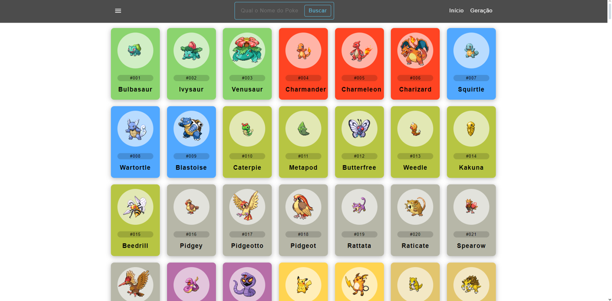

# Título e Introdução

**Objetivo:**
Converter Trabalho de Pokédex em HTML para React

**Alunos:**
- Henrique
- Tales
- Robson
- Leonardo

---

# Site

---

# Hooks

**Resumo dos Hooks:**

- **useState:** 10 instâncias (8 em `App.js`, 2 em `InfoPoke.js`)
- **useEffect:** 3 instâncias (1 em `App.js`, 2 em `InfoPoke.js`)
- **useParams:** 1 instância (`InfoPoke.js`)
- **useNavigate:** 1 instância (`PokemonCard.js`)

**Total de 15 instâncias de hooks utilizados no projeto.**

---

# Rotas

**Total de 2 rotas utilizadas no projeto:**

- `/`
- `/pokemon/:id`

---

# Componentes do Cabeçalho

**Pontos:**

- Menu de busca
- Filtro por geração
- Ícone do sidebar
- Filtro por tipos

---

# Componentes Principais Interatividade

**Pontos:**

- Cards dos Pokémon
- Interatividade ao passar o mouse

---

# Estilização CSS

**Pontos:**

- Estrutura básica do CSS
- Estilização dos componentes principais
- Comentários no CSS 

---

# Desafios e Soluções

**Pontos:**

- Desafios enfrentados
- Soluções implementadas

---

# Agradecimentos

Obrigado!
